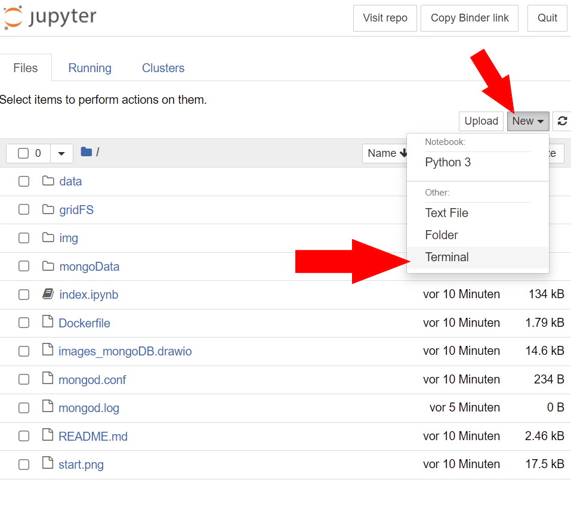
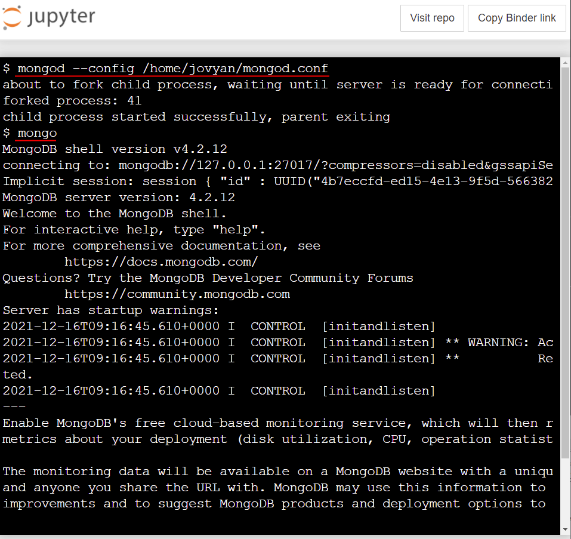

# MongoDB Shell

Diese Anleitung zeigt wie man im Lernmodul eine MongoDB-Shell öffnet.

## Online Ausführen mit Binder

Folgenden Link Aufrufen und ca. 3 Minuten! warten. 

[JupyterApp](https://mybinder.org/v2/git/https%3A%2F%2Fprojectbase.medien.hs-duesseldorf.de%2Feild.nrw-module%2Flernmodul-mongodb/master)

Hinweis: Sollte das Laden der Seite 5 Minuten überschreiten, einfach den Link nocheinmal öffen.


## Lokales Ausführen mit Docker

```sh
docker clone https://projectbase.medien.hs-duesseldorf.de/eild.nrw-module/lernmodul-mongodb.git
```

```sh
docker build -t lernmodulmongo:1.0 .
```

```sh
docker run -p 8888:8888 lernmodulmongo:1.0
```

Klicken Sie dann auf den unteren Link der im Terminal angezeigt wird. 
Das Lernmodul wird sich dann in einem Browserfenster öffnen.
```
    To access the notebook, open this file in a browser:
        file:///home/hsd/.local/share/jupyter/runtime/nbserver-1-open.html
    Or copy and paste one of these URLs:
        http://6c2e5becaead:8888/?token=f9a04dd74a45ae98be80c7d78d0b322ad7f886b0ff0daf77
     or http://127.0.0.1:8888/?token=f9a04dd74a45ae98be80c7d78d0b322ad7f886b0ff0daf77
```

Eine umfassende Anleitung wie das Notebook gestartet und Docker installiert werden kann findet sich in dieser [Anleitung](https://projectbase.medien.hs-duesseldorf.de/eild.nrw/eild.nrw-mp/-/wikis/Technik/Jupyter-Notebook-lokal-mit-Docker-starten) 

# Die MongoDB Shell öffnen



